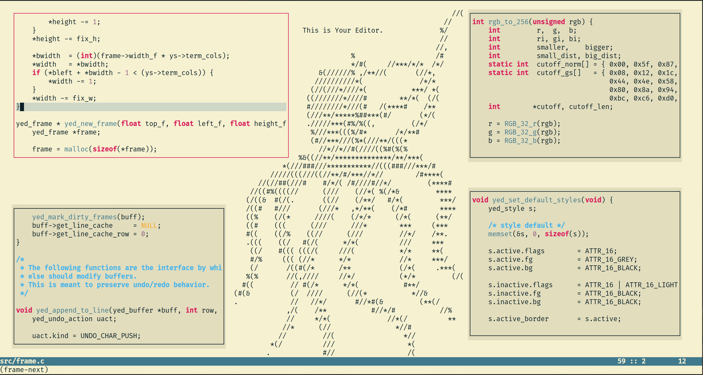

# yed (Your Editor)

Check out our web page for more info!
[your-editor.org](https://your-editor.org)

[](https://repology.org/project/your-editor/versions)

# TL;DR
**A fast, fully customizable text-mode editor with zero dependencies.**
```
git clone https://github.com/kammerdienerb/yed && cd yed
./install.sh -p ./test
test/bin/yed
```


# Introduction
`yed` is a small and simple terminal editor core that is meant to be extended through a powerful plugin architecture.
The editor base is command driven, lightweight, and fast.
It makes no assumptions about a user's desired editing style and leaves most functionality up to implementation and configuration plugins.
## Core Editor Features
- _FAST_
- Dependency free
- Layered frame management
- 24-bit truecolor support
- Dynamic key bindings and key sequences
- Undo/redo
- Live find and replace
- Customization/extension via plugins



## Plugins
`yed` plugins are shared libraries (typically written in C) that use the various facilities provided by the core editor to implement customization and add additional functionality.
A plugin may:
- Add commands
- Set/unset variables
- Define key bindings
- Manipulate buffers and frames
- Define styles
- Register event handlers, allowing it to:
    - Control how text is drawn
    - Intercept keystrokes
    - Programmatically send keystrokes
    - Perform actions on save
    - More!
