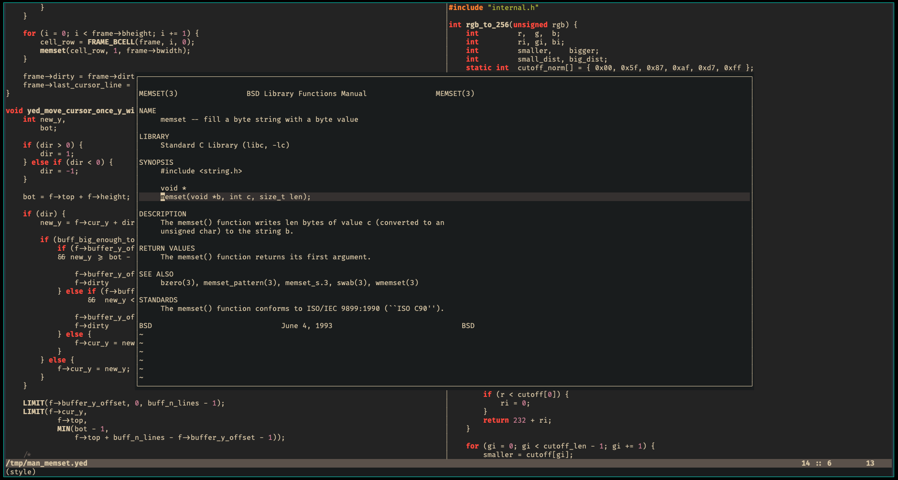

# yed (Your Editor)

# TL;DR
**A fast, fully customizable text-mode editor with zero dependencies.**
```
git clone https://github.com/kammerdienerb/yed && cd yed
./build.sh
./yed
```



# Introduction
`yed` is a small and simple terminal editor core that is meant to be extended through a powerful plugin architecture.
The editor base is command driven, lightweight, and fast.
It makes no assumptions about a user's desired editing style and leaves most functionality up to implementation and configuration plugins.
## Core Editor Features
- _FAST_
- Dependency free
- Layered frame management
- 24-bit truecolor support
- Dynamic key bindings and keys sequences
- Undo/redo
- Live find and replace
- Customization/extension via plugins

## Plugins
`yed` plugins are shared libraries (typically written in C) that use the various facilities provided by the core editor to implement customization and add additional functionality.
A plugin may:
- Add commands
- Set/unset variables
- Define key bindings
- Manipulate buffers and frames
- Define styles
- Register event handlers, allowing it to:
    - Control how text is drawn
    - Intercept keystrokes
    - Programmatically send keystrokes
    - Perform actions on save
    - More!

# Getting Started
## Requirements
1. C Compiler supporting `-std=gnu99`
## Build
`./build.sh`
## Install
`sudo ./install.sh`

# Configuration
The starting poing for `yed` is a plugin called `init`.
By default, an installed version of `yed` will attempt to load `init.so` from `~/.yed`.
If desired, the flag `--init=<path>`, or `-i <path>` can be used to provide a path to a directory containing an `init.so` to load instead.

The only difference between `init` and any other plugin is that `init` is automatically loaded.

`install.sh` will install a set of plugins and an `init.so` that loads an example configuration.
To understand the provided configuration, read the rest of this section and the documentation for the plugins that it loads.

The following will show how basic configuration can be done in `init`.

A typical `init.c` look something like this:
```c
#include <yed/plugin.h>

int yed_plugin_boot(yed_plugin *self) {
    /* Configuration here.. */

    return 0;
}
```

Keys can be bound to run commands by using `yed_plugin_bind_key()`, or the more convenient `YPBIND()` macro.
```c
#include <yed/plugin.h>

int yed_plugin_boot(yed_plugin *self) {
    /* Bind ctrl-w to the 'write-buffer' command. */
    yed_plugin_bind_key(self, CTRL_W, "write-buffer", 0, NULL);

    /* Bind ctrl-l to show the output of 'ls'. */
    YPBIND(self, CTRL_L, "less", "ls");

    return 0;
}
```

More plugins can be loaded with `yed_load_plugin()`.
```c
#include <yed/plugin.h>

int yed_plugin_boot(yed_plugin *self) {
    /* <Previous configuration> */

    /* Load a style plugin. */
    yed_load_plugin("styles/monokai");

    return 0;
}
```

`yed` commands can be executed with `yed_execute_command()` or the more convenient `YEXE()` macro.
```c
#include <yed/plugin.h>

int yed_plugin_boot(yed_plugin *self) {
    /* <Previous configuration> */

    /*
     * Apply the style.
     */

    /* Manually: */
    yed_activate_style("monokai");

    /* By executing a command: */
    char *args[] = { "monokai" };
    yed_execute_command("style", sizeof(args)/sizeof(char*), args);

    /* Easier way: */
    YEXE("style", "monokai");

    return 0;
}
```

Custom commands can be added with `yed_plugin_set_command()`.
Variables may be set, unset, or read with `yed_set_var()`, `yed_unset_var()`, and `yed_get_var()`, respectively.
Event handlers may be registered with `yed_plugin_add_event_handler()`.

In this example, the command `buff-mod-var-set` can be run manually, and it will also be run after every buffer modification event.
```c
#include <yed/plugin.h>

void buff_mod_var_set(int n_args, char **args) {
    yed_set_var("buffer-has-been-modified", "yes");
}

void my_handler(yed_event *event) {
    YEXE("buff-mod-var-set");
}

int yed_plugin_boot(yed_plugin *self) {
    /* <Previous configuration> */

    yed_plugin_set_command(self, "buff-mod-var-set", buff_mod_var_set);

    yed_event_handler h;
    h.kind = EVENT_BUFFER_POST_MOD;
    h.fn   = my_handler;

    yed_plugin_add_event_handler(self, h);

    return 0;
}
```

To create your own `init` (or any other) plugin, compile it like this:
```sh
gcc -shared init.c -lyed -o init.so
```

`init.so` can then be moved to `~/.yed` to be loaded automatically.

For more examples of configurations and plugins, see the C files in `plugins/`.

# Included Plugins
| Plugin            | Description                                                                                                                               |
|-------------------|-------------------------------------------------------------------------------------------------------------------------------------------|
| vimish            | A modal editing front end that is _like_ `vim`, but different.                                                                            |
| style_picker      | Opens up a menu-style frame that allows you to preview and select from available styles.                                                  |
| styles/gruvbox    | A dark truecolor style. Provides 256-color fallback.                                                                                      |
| styles/casey      | A dark truecolor style. Provides 256-color fallback.                                                                                      |
| styles/papercolor | A light truecolor style. Provides 256-color fallback.                                                                                     |
| styles/skyfall    | A dark truecolor style. Provides 256-color fallback.                                                                                      |
| styles/first      | One dark and one light truecolor styles. Provides 256-color fallbacks.                                                                    |
| styles/monokai    | A dark 256-color style.                                                                                                                   |
| styles/nord       | A dark truecolor style. Provides 256-color fallback.                                                                                      |
| styles/elise      | A dark truecolor style.                                                                                                                   |
| completer         | Implements BASH-like completion of words from open buffers on `TAB`.                                                                      |
| comment           | Provides the `comment-toggle` command to toggle lines of code in C/C++, BASH, bJou, and LaTeX.                                            |
| tag_hl            | Highlights words prefixed with `@` with the `attention` style attribute.                                                                  |
| cursor_word_hl    | Highlights other instances of the work under the cursor with the `associate` style attribute.                                             |
| brace_hl          | Highlights enclosing pairs of curly braces with `attention` style attribute.                                                              |
| wait_keys         | Implements a mechanism to define virtual keys where the first waits indefinitely on the second.                                           |
| man               | Provides the `man-word` command that opens the `man` page for the word under the cursor in a buffer in a floating frame.                  |
| grep              | Provides the `grep` command that interactively greps for a pattern in the current directory and allows you to instantly jump to matches.  |
| find_file         | Provides the `find-file` command that interactively searches for files in the current directory and allows you to instantly jump to them. |
| lang/bjou         | Loads `lang/syntax/bjou`.                                                                                                                 |
| lang/c            | Loads `lang/syntax/c`.                                                                                                                    |
| lang/sh           | Loads `lang/syntax/sh`.                                                                                                                   |
| lang/latex        | Loads `lang/syntax/latex` and `lang/tools/latex`.                                                                                         |
| lang/syntax/bjou  | Provides syntax highlighting for bJou.                                                                                                    |
| lang/syntax/c     | Provides syntax highlighting for C. Active on C++ buffers.                                                                                |
| lang/syntax/sh    | Provides syntax highlighting for SHELL and BASH.                                                                                          |
| lang/syntax/latex | Provides (_very basic_) syntax highlighting for LaTeX.                                                                                    |
| lang/tools/latex  | Provides the `latex-compile-current-file` and `latex-view-current-file` commands.                                                         |
| autotrim          | Removes trailing whitespace on buffer write.                                                                                              |
| focus_frame       | Creates an 80 column frame centered on the screen.                                                                                        |
| indent_c          | Implements automatic indentation behavior for C-like languages.                                                                           |
| meta_keys         | Allows one to use meta (alt) keys in keybindings.                                                                                         |


